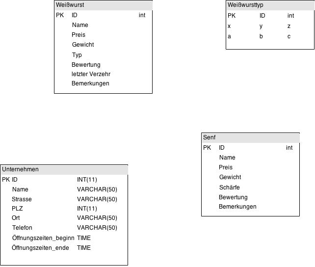

- Daniel Diekmeier (544835)
- Elias Klemm (546032)
- Robert Koerber (545073)
- Robert Piwonski (544838)

# Semesterprojekt im Kurs Datenbanken
## Wintersemester 14/15 – Weißwurst-Datenbank

## Zusammenfassung
Da wir an einem Datenbank-Modell arbeiten wollten, dass wir wenigstens ein-, zweimal aus Spaß selbst benutzen können, haben wir uns für eine Datenbank entschieden, in der wir unseren Weißwurstkonsum unserer regelmäßig stattfindenden Weißwurstessen abbilden können. Dabei sollen Weißwürste, Senfsorten, Unternehmen, wie zum Beispiel Supermärkte oder Fleischer, sowie Nutzerbewertungen der Würste gespeichert werden. Wir hatten im Zuge der Entwicklung mit einigen Meinungsänderungen und technischen Problemen zu kämpfen, die wir aber zu unserer Zufriedenheit lösen konnten.

## Zugriffsdaten
- Host: 		db.f4.htw-berlin.de
- Username: 	s0544835
- Passwort: 	Bitte bei Daniel erfragen
- Database: 	_s0544835__weisswurst
- Port: 		3306

## Funktionsumfang
Da wir die Datenbank am Ende selbst benutzen wollten, haben sich während der Entwicklungszeit einige Anforderungen unsererseits geändert, sodass der zunächst angedachte grundsätzliche Aufbau nicht vollständig umgesetzt wurde. Allerdings haben wir in allen Fällen, in denen eine Vorgabe von unseren Änderungen betroffen war, einen adäquaten Ersatz überlegt.

Es ist nun möglich …

## Urprünglicher, grundsätzlicher Aufbau
- Eine Tabelle mit Weißwürsten:
	- Die Herkunft der Wurst, also den Schlachter, die Metzgerei, und den Markt, der diese Sorte verkauft, sollen gespeichert werden.
	- Bestimmte Besonderheiten sollen kenntlich gemacht werden: ob die Wurst frisch vom Fleischer stammt, oder im Kühlregal fertig verpackt zu finden ist, oder ob die Wurst in Naturdarm oder in künstlichen Darm gefüllt wurde.
	- Außerdem sollen weitere Bemerkungen als Freitext gespeichert werden. z. B., ob besondere Aromen besonders hervorstechen, oder wo bestimmte Verfügbarkeiten vermerkt werden.
	- Ein Bewertungssystem, das die Wurst in einem einfachen System von 1 bis 5 Sternen bewertet, was unserem subjektiven Geschmacksempfinden entspricht

- Eine Tabelle mit den entsprechenden Händlern, also Fleischereien und Supermärkten und sonstige Geschäfte
	- Adressen und die Öffnungszeiten werden dort vermerkt.

- Eine Tabelle mit Senfsorten:
	- Der vollständige Name
	- Die Art des Senfes, als Auswahl von „Süß“, „Mittelscharf“ und „Scharf“, sowie „Besondere Sorte“, mit der z. B. Frucht-Senf gekennzeichnet werden kann.
	- Wie bei der Weißwurst-Tabelle, soll das Geschäft gespeichert werden.
	- Eine Spalte für sonstige Bemerkungen als Freitext

Die Tabellen der Senfsorten und der Weißwürste sollen derart miteinander verknüpft werden, dass auch eine Bewertung gespeichert wird, die das Zusammenspiel von Senf und Wurst speichert

Zu guter Letzt sollen die Tabellen für Senf und Weißwürste mit den Geschäften verknüpft werden, in denen man sie kaufen kann.

## Beispielanwendungen
- Wir möchten herausfinden, welcher Senf besonders gut zu einer bestimmten Wurstsorte passt.
- Wir möchten uns nur Senfsorten und Würste anzeigen lassen, die beim gleichen Geschäft zu kaufen sind
- Beim Einkauf auf den letzten Drücker wollen wir herausfinden, welche Geschäfte am Samstag nach 19:00 Uhr offen haben.
- Für die wahren Zuzler kommt natürlich nur echter Darm in Frage, also sollen alle Suchen auf Würste nur in Naturdarm beschränkt werden können.

## Durchführung

### Konzeptuelles und physisches Schema
Wir haben haten aus dem bereits vorhandenen Konzept ein Entity-Relationship-Modell entwickelt welches alle Relationen darstellt. Jedoch wurde das Modell immer wieder kleineren und größeren Änderungen unterworfen (Beispiele unter *Änderungen während der Modellierungsphase*), sodass wir uns entschieden haben hier nur das finale Diagram zu zeigen.



Aus diesem wurde ein Datenbankmodell welches zusätzlich Datentypen definiert. (Dieser Punkt stimmt glaube ich noch nicht ganz.)

### Prozeduren
**Beispiel** `laden_geoeffnet`

Um herauszufinden, ob ein bestimmtes Geschäft noch zur aktuellen Uhrzeit offen hat, haben wir uns eine Prozedur programmiert, die uns eine entsprechende Meldung mit der verbleibenden Öffnugszeit ausgibt.

```sql
CREATE PROCEDURE `laden_geoeffnet`(in unternehmen_id integer)
BEGIN 
    DECLARE o_ende TIME;
    DECLARE o_anfang TIME;
    DECLARE unternehmen_name char(40);
    SELECT name INTO unternehmen_name FROM unternehmen WHERE id = unternehmen_id;
    IF is_open(unternehmen_id) THEN
        SELECT oeffnungszeiten_ende INTO o_ende FROM unternehmen WHERE id = unternehmen_id;
        SELECT CONCAT('Das Unternehmen ', unternehmen_name, ' hat noch ', TIMEDIFF(o_ende, CURTIME()), ' Stunden, Minuten und Sekunden geöffnet.');
    ELSE
        SELECT oeffnungszeiten_beginn INTO o_anfang FROM unternehmen WHERE id = unternehmen_id;
        SELECT CONCAT('Das Unternehmen ', unternehmen_name, ' ist geschlossen und öffnet um ', o_anfang);
    END IF;
END;
```
Diese Prozedur wird mit einer Unternehmens-ID aufgerufen. Zunächst wird über die Prozedur `is_open` (näher Beschrieben im folgenden Abschnitt *Funktionen*) geprüft, ob das Unternehmen offen hat. Hat es offen, wird der Name und die Schließzeit des Unternehmens abgefragt. In der Meldung wird die Schließzeit mit der aktuellen Uhrzeit verrechnet, um eine verbleibende Öffnungszeit anzugeben. Hat es geschlossen, wird die Öffnugszeit mit der aktuellen Uhrzeit verrechnet um die verbleibende Zeit auszurechnen, bis das Unternehmen wieder öffnet.

### Funktionen
**Beispiel** `is_open`

Diese Funktion gibt Antwort auf die Frage, ob ein Unternehmen zurzeit offen hat.

```sql
CREATE FUNCTION `is_open`(id_unternehmen INTEGER) RETURNS tinyint(1)
BEGIN
    DECLARE output BOOLEAN;
    DECLARE time_begin TIME;
    DECLARE time_ende TIME;
    SELECT oeffnungszeiten_beginn INTO time_begin FROM unternehmen WHERE id = id_unternehmen;
    SELECT oeffnungszeiten_ende INTO time_ende FROM unternehmen WHERE id = id_unternehmen;
    SET output = false;
    IF time_begin < now() AND time_ende > now() THEN
        SET output = true;
    END IF;
    RETURN output;
END;
```

Diese Funktion wird mit einer Unternehmens-ID aufgerufen und gibt einen boolschen Rückgabewert. Von diesem Unternehmen werden die Öffnungs- und Schließzeiten abgefragt. Schließlich wird der Rückgabewert standardmäßig auf `false` gesetzt. Liegt aber die Öffnungszeit vor und die Schließzeit nach der aktuellen Uhrzeit, was bedeutet, dass das Geschäft gerade offen ist, wird der Rückgabewert `true` gesetzt. Zu guter Letzt wird der entsprechende Wert zurückgegeben.

### Sicht

Ein Anwendungsfall, der sehr häufig auftritt, ist, alle Läden zu finden, die aktuell geöffnet sind. Dazu erstellten wir eine Sicht wie folgt:

```sql
CREATE VIEW laeden_geoeffnet AS 
	SELECT unternehmen.name AS name
	FROM (unternehmen 
		LEFT JOIN unternehmen_typ ON (unternehmen.typ = unternehmen_typ.id)
	) WHERE (
		(is_open(unternehmen.id) AND 
		(unternehmen_typ.beschreibung <> 'Hersteller')
	);
```

### Änderungen während der Modellierungsphase
- Die Abstufungen bezüglich dem Schärfegrad von Süß, Mittelscharf, Scharf und Besondere Sorte soll zu einer numerischen von 1-100 geändert werden. Somit entsteht die Möglichkeit zwei ähnlich scharfe Senfe miteinander zu vergleichen.
- Wir haben uns dazu entschlossen eine eigene Tabelle für die Weiswurst Typen zu definieren da diese immer wieder vorkommen und die Eindeutigkeit verbessert werden kann.
- Aus Gründen der Ähnlichkeit haben wir die Fleischer und Verkäufer in die Tabelle `Unternehmen` gebündelt. Somit sind diese zentral verwaltbar. Das führte allerdings zu dem Problem, dass eine Wurst von einem Unternehmen hergestellt und von einem weiteren verkauft wird. Daher definieren wir eine Tabelle `Unternehmenstyp` um eine Unterscheidung festzuhalten.

### Probleme
- Ursprünglich hatten wir uns für eine Datenbank mit MySQL entschieden, damit wir diese zentral auf einem HTW-eigenen Server speichern und alle Gruppenteilnehmer darauf zugreifen können. Jedoch mussten wir bei einem unserer Treffen Verbindungsabbrüche / Probleme mit dem Aufbau feststellen. Dies ist auf die Limitierung von einzelnen Verbindungen auf die Datenbank zurückzuführen (`Mysql Error 1203`). Bei späteren Treffen trat dieses Problem glücklicherweise nicht mehr auf, was Vermuten lässt, dass es sich um ein temporäres Problem im HTW-Rechenzentrum handelte.
- In der Funktion `is_open` werden von dem selben Unternehmen sowohl `oeffnungszeiten_beginn` als auch `oeffnungszeiten_ende`, was nahe legt, diese Abfragen in einer Select-Anweisung abzuhandeln und in den jeweiligen Funktionsvariablen zwidschenzuspeichern. Es hat uns einige Zeit und Nerven gekostet, herauszufinden, dass das nicht möglich ist. Die Lösung war es, die Daten einzeln abzufragen und zu speichern.
